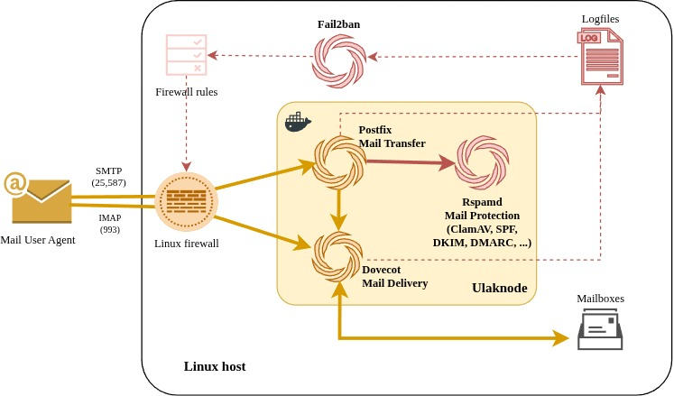

# ulaknode — self-hosted mail server

**Postfix + Dovecot + Rspamd + ClamAV — a complete business mail stack in a single Docker container.**

Deploy on any Linux server or VPS. No cloud dependency. No per-seat fees. Your data stays on your infrastructure.

---

## What's included

| Component | Role |
|---|---|
| **Postfix** | SMTP — sends and receives email |
| **Dovecot** | IMAP — mailbox access from any mail client |
| **Rspamd** | Spam filtering, greylisting, DKIM/DMARC/ARC signing |
| **ClamAV** | Antivirus scanning on all incoming mail |

---

## Quick start

### Prerequisites

- Linux server (Debian 12 or Ubuntu 22.04+ recommended)
- 2 vCPU, 4 GB RAM, 40 GB disk minimum
- Docker installed — `curl -fsSL https://get.docker.com | sh`
- A domain name with DNS management access
- A TLS certificate for your mail hostname (Let's Encrypt works)

### Deploy

```bash
git clone https://github.com/itefix/ulaknode.git
cd ulaknode
```

Edit `docker-compose.yml` — set your hostname and certificate paths:

```yaml
hostname: mail.yourdomain.com
environment:
  - MAIL_HOSTNAME=mail.yourdomain.com
volumes:
  - /etc/letsencrypt/live/mail.yourdomain.com/fullchain.pem:/run/certs/fullchain.pem:ro
  - /etc/letsencrypt/live/mail.yourdomain.com/privkey.pem:/run/certs/privkey.pem:ro
```

Then start:

```bash
docker compose up -d
```

---

## Managing domains and mailboxes

```bash
# Add a domain
docker exec ulaknode ulaknode-domain add yourdomain.com

# Add a mailbox
docker exec ulaknode ulaknode-mailbox add alice@yourdomain.com secretpassword

# Add an alias
docker exec ulaknode ulaknode-alias add info@yourdomain.com alice@yourdomain.com

# Set a quota
docker exec ulaknode ulaknode-mailbox quota-set alice@yourdomain.com 5G

# List mailboxes
docker exec ulaknode ulaknode-mailbox list yourdomain.com
```

## Email security (DKIM, SPF, DMARC)

```bash
# Generate DKIM key — prints the DNS TXT record to publish
docker exec ulaknode ulaknode-dkim generate yourdomain.com

# Generate SPF record
docker exec ulaknode ulaknode-spf generate yourdomain.com --mx

# Generate DMARC record
docker exec ulaknode ulaknode-dmarc generate yourdomain.com \
  --policy none --rua mailto:postmaster@yourdomain.com
```

---

## Ports

| Port | Purpose |
|---|---|
| 25 | SMTP — inbound mail |
| 587 | Submission — outbound mail from clients |
| 993 | IMAPS — mailbox access (TLS) |

---

## Full deployment guide

See [docs/self-hosted.md](docs/self-hosted.md) for the complete setup walkthrough including DNS, firewall, brute-force protection, and TLS.

---

## Commercial use & support

ulaknode is free to use. If you run it in a commercial setting and want professional support or a maintenance agreement, visit [itefix.net/ulaknode](https://itefix.net/ulaknode).

---

## License

BSD 2-Clause — see [LICENSE](LICENSE).
