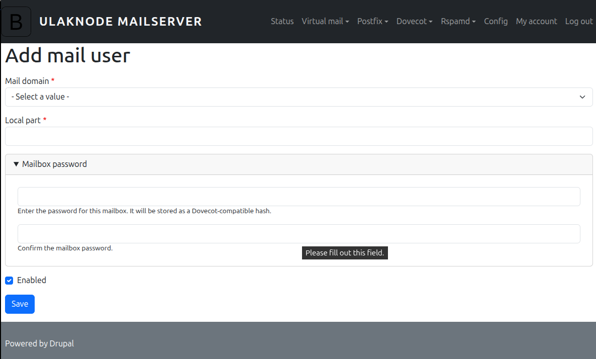

<div align="center">

# Ulaknode — all‑in‑one mail server with a Drupal 11 admin UI

Postfix + Dovecot + Rspamd + ClamAV + Fail2ban + Apache/Drupal — supervised in one container.

</div>

> Status: Early-stage (alpha). Expect rapid changes; not production-ready.

 

## Screenshots

<details>
  <summary>Show screenshots</summary>

  <p align="center">
    
    
  </p>

  <p align="center">
    
    
  </p>

  <p align="center">
    
    
  </p>

  <p align="center">
    
    
  </p>

  <p align="center">
    
    
  </p>

  <p align="center">
    
  </p>

  <p align="center">
    <em>Add PNGs under <code>docs/images/</code> with the names above to populate this gallery.</em>
  </p>

</details>

## What is this?

Ulaknode is a single‑container mail stack that ships with a Drupal 11 site as the admin/frontend. It bundles:

- Postfix (SMTP 25/587) for mail transfer and LMTP delivery
- Dovecot (IMAP 143/993) for mailbox access and SASL auth
- Rspamd for spam filtering, DKIM/DMARC/ARC, greylisting, and the Rspamd web UI
- ClamAV (clamd + freshclam) for antivirus scanning via Rspamd
- Fail2ban to block brute‑force attempts
- Apache + PHP + Drush to serve Drupal and manage the stack
- Supervisor to keep all services running together
- File Browser UI (proxied at /files) for browsing config files (no auth by default)

The image initializes Drupal automatically (SQLite), creates the virtual‑mail schema, and generates service configs on first run.

## Quick start

Minimum requirements: Docker, public ports allowed (your ISP may block TCP/25), and two env vars for the initial Drupal admin.

```bash
# Build locally
docker build -t ulaknode:local .

# Run (adjust hostnames, volumes, and passwords!)
docker run -d \
  --name ulaknode \
  --hostname mail.example.com \
  -p 80:80 -p 25:25 -p 587:587 -p 143:143 -p 993:993 \
  -v ulak_drupal_www:/var/www/html \
  -v ulak_drupal_db:/var/lib/drupal \
  -v ulak_mail:/var/mail \
  -v ulak_logs:/var/log \
  -v ulak_clamav:/var/lib/clamav \
  -v ulak_conf:/etc/ulaknode \
  -v ulak_sqlite:/var/lib/sqlite \
  -e ULAKNODE_DRUPAL_ADMIN_USER=admin \
  -e ULAKNODE_DRUPAL_ADMIN_PASSWORD='change-me' \
  ulaknode:local
```

Then:

- Visit http://localhost/ for the Drupal UI
- Rspamd UI: http://localhost/rspamd/
- File Browser: http://localhost/files/ (no auth; protect it!)

> Tip: If running behind a reverse proxy/load‑balancer, set `ULAKNODE_REVERSE_PROXY_IP` to the proxy’s IP so Drupal trusts forwarded headers.

## Ports, data, and processes

- Exposed ports: 80 (HTTP), 25 (SMTP), 587 (Submission), 143 (IMAP), 993 (IMAPS)
- Persistent data (recommended mounts):
  - `/var/www/html` — Drupal codebase
  - `/var/lib/drupal` — Drupal SQLite DB (`db.sqlite`)
  - `/var/mail` — Mailboxes
  - `/var/log` — Logs for all services
  - `/var/lib/clamav` — Virus DB cache
  - `/var/lib/sqlite` — Virtual mail DB (`vmail.db`)
  - `/etc/ulaknode` — All service configs (managed/user/active)
- Supervisor starts and monitors: freshclam, clamd, apache2, rspamd, postfix, dovecot, fail2ban, filebrowser

## Configuration model (managed → user → active)

Service configs are layered and compiled at container startup:

- Managed configs: `/etc/ulaknode/<service>/managed` (shipped with image)
- Your overrides: `/etc/ulaknode/<service>/user` (persist and edit these)
- Active configs: `/etc/ulaknode/<service>/active` (generated by scripts)

Scripts run by the entrypoint to materialize configs:

- `generate-postfix-conf` — builds `main.cf` from managed + user `*.cf` and copies `master.cf`
- `generate-dovecot-conf` — copies managed, then adds any missing files from user
- `generate-rspamd-conf` — copies managed set
- `set-conf-permissions` — sets `root:ulaknode-mail` ownership, read‑only by default; `.../user` dirs are group‑writable

You can rerun these inside the container after editing configs:

```bash
docker exec -it ulaknode bash -lc "generate-postfix-conf && generate-dovecot-conf && generate-rspamd-conf && set-conf-permissions && supervisorctl restart postfix dovecot rspamd"
```

## Virtual mail storage

- SQLite DB: `/var/lib/sqlite/vmail.db`
- Schema includes `virtual_domains`, `virtual_users`, `virtual_aliases` (see `sqlite3/vmail-schema.sql`)
- The included Drupal modules (e.g., `ulaknode_vmail`) are intended to manage domains, users, and aliases — prefer the UI over manual SQL

## Drupal initialization

On first start the entrypoint will:

1. Create `sites/default/settings.php` for SQLite and the DB file at `/var/lib/drupal/db.sqlite`
2. Install Drupal (minimal) with Drush using `ULAKNODE_DRUPAL_ADMIN_USER` and `ULAKNODE_DRUPAL_ADMIN_PASSWORD`
3. Enable core modules and Ulaknode custom modules:
   - `ulaknode_status`, `ulaknode_vmail`, `ulaknode_postfix`, `ulaknode_dovecot`,
     `ulaknode_rspamd`, `ulaknode_rspamd_dkim_signing`, `ulaknode_rspamd_clamav`,
     `ulaknode_menu`, `ulaknode_config`
4. Generate active configs for Postfix, Dovecot, Rspamd and fix permissions

Optional environment variables:

- `ULAKNODE_DRUPAL_SITE_NAME` — defaults to "Ulaknode"
- `ULAKNODE_REVERSE_PROXY_IP` — trust this IP for `X-Forwarded-*` headers in Drupal

Required environment variables:

- `ULAKNODE_DRUPAL_ADMIN_USER`
- `ULAKNODE_DRUPAL_ADMIN_PASSWORD`

## Admin endpoints behind Apache

The Apache vhost proxies two internal services by default:

- `/rspamd/` → Rspamd controller on 127.0.0.1:11334
- `/files/` → File Browser on 127.0.0.1:8080 (started with `--noauth`)

Security note: Protect these paths (IP allow‑list, basic auth, SSO, or remove the proxies) before exposing the site to the internet.

Note: The Dockerfile expects a `filebrowser` binary in the repo root at build time (`COPY filebrowser /usr/local/bin/filebrowser`). If you don’t include it, remove the File Browser program from `supervisor/supervisord.conf` and the proxy from `apache2/drupal.conf`.

## Operating the stack

Inside the container you have two helpers (sudoers allow www‑data to use them without a password):

- `ulaknode-service <start|stop|restart|status> <apache2|postfix|dovecot|rspamd|clamav|fail2ban|filebrowser|freshclam>`
- `ulaknode-logtail <service>` — prints the last 50 lines of the service’s `*.err` log

Examples:

```bash
docker exec -it ulaknode ulaknode-service status postfix
docker exec -it ulaknode ulaknode-logtail rspamd
```

## Troubleshooting

- "Site didn’t install": check `docker logs ulaknode` and `docker exec -it ulaknode drush status`
- Permission issues after editing `/etc/ulaknode`: run `fix-permissions /etc/ulaknode` or `set-conf-permissions`
- SMTP blocked: many hosts/ISPs block TCP/25 — use a smarthost/relay or a cloud with open egress
- TLS: terminate TLS at your reverse proxy or add certs to Apache/Postfix/Dovecot configs in `.../user` and regenerate

## Known notes and limitations

- The Dockerfile defines `DRUPAL_DB_PATH`, but the entrypoint uses `/var/lib/drupal/db.sqlite` (the latter is authoritative)
- File Browser and Rspamd UIs are proxied without auth — secure or disable those paths

## Repository layout (high‑level)

- `Dockerfile`, `docker-entrypoint.sh` — image build and first‑run initialization
- `apache2/drupal.conf` — Apache vhost; proxies `/rspamd/` and `/files/`
- `postfix/`, `dovecot/`, `rspamd/` — managed configs copied into `/etc/ulaknode/.../managed`
- `scripts/` — config generators and utilities used by the entrypoint
- `supervisor/` — process supervision config
- `sqlite3/vmail-schema.sql` — schema for virtual mail

## Development

Ulaknode is being developed for our [OpsBay](https://opsbay.com) service infrastructure.

## License

BSD 2‑Clause — see `LICENSE`.

